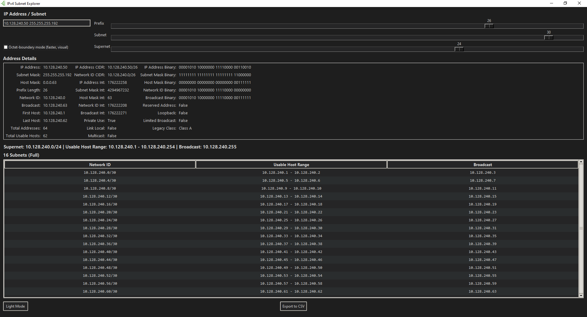
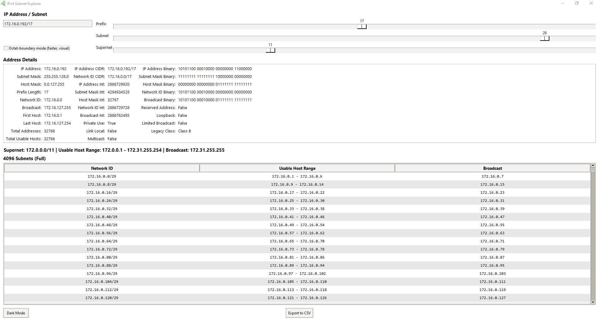

# IPv4 Subnetting Step-by-Step Explainer

## Overview

This project is a **learning-focused** Python tool with both a command-line interface and a graphical interface, designed to demonstrate the principles of IPv4 subnetting in a detailed, step-by-step, educational manner.

It covers:

* Subnet masks, CIDR prefixes, and host masks
* Network and broadcast addresses
* Total addresses and usable host counts

It is designed to help you understand subnetting rather than just memorize formulas.

---

## Key Features

* Step-by-step subnetting explanations
* Multiple solving methods (binary, block size, prefix math)
* CLI with options for subnet and supernet calculations
* Python class for integration into custom scripts
* Tkinter-based GUI for interactive subnet exploration
* Multiple input formats supported
* Built-in validation checks
* Beginner-friendly output
* /31 and /32 networks are handled according to RFC behavior (/31 for point-to-point, /32 as single-host)
* Input validation is performed for supported formats

Unlike traditional subnet calculators, this tool focuses on understanding the process, not just producing results.

---

## Quick Start

To quickly get started, you can use either the command-line interface or the graphical interface.

**CLI:**

```bash
python cli.py 192.168.1.10/24 --explain
```

**GUI:**

```bash
python gui.py
```

The CLI provides detailed step-by-step explanations, while the GUI offers interactive, real-time exploration of the same concepts.

---

## Purpose

Subnetting can feel confusing due to the many different ways it can be solved and the fact that many tutorials skip over the details. This tool focuses on clarity by:

* Breaking subnetting into structured steps
* Showing multiple solving methods
* Explaining the reasoning behind each result

Think of it as a guided walkthrough, similar to how an instructor would explain problems on a whiteboard.

It also introduces simplified subnetting strategies (such as octet-boundary subnetting) to help build intuition before moving to full variable-length subnetting.

---

## Target Audience

This tool is best suited for:

* Students learning networking
* Beginners struggling with subnetting concepts
* Anyone who wants to verify their work step-by-step
* Anyone who wants to learn additional subnetting methods

---

## How to Use

This tool can be used via the command line, a graphical interface, or as a Python class. All interfaces support multiple IPv4 input formats. It can be used for quick calculations, step-by-step learning, or verifying your work.

### Basic Usage

```bash
python cli.py <address> [extra] [options]
```

Where `<address>` is the IPv4 address in one of several supported formats, and options are described below.

---

### Arguments

* `address`
  The IPv4 address in one of the following formats:

  * Dotted decimal

    ```bash
    172.30.5.0
    ```

  * CIDR notation

    ```bash
    127.0.5.1/24
    ```

  * IP address + subnet mask

    ```bash
    10.0.6.7 255.255.255.0
    ```

  * Integer representation + prefix length

    ```bash
    16843009 /8
    ```

  * Integer representation only

    ```bash
    1157895235
    ```

* `extra` *(optional)*
  Used when the address format requires a second value (e.g., subnet mask or prefix length).

### Options

* `--explain`
  Provides a detailed educational explanation of the subnetting process.

* `--show-steps`
  Displays the calculation steps without additional explanations.

* `--subnet`
  Prints the CIDR notation of the subnet(s) corresponding to the given address and prefix length.

* `--subnet-limit`
  Maximum number of subnet entries to generate and display. Set to `0` to disable the limit (all subnets will be generated). Default is `1000`.

* `--octet-boundary`
  Constrains the displayed subnet enumeration range to an octet-aligned window for visualization purposes. This does not change subnet size, block size, or calculation logic, only the range of subnets that are iterated and shown.

* `--supernet`
  Prints the CIDR notation of the supernet network ID.

---

### Examples

**Basic subnet calculation:**

```bash
python cli.py 192.168.1.10/24
```

**Using IP + subnet mask:**

```bash
python cli.py 10.0.0.1 255.255.255.0
```

**Calculate the subnet for a specific prefix:**

```bash
python cli.py 192.168.1.10/24 --subnet 28
```

**Subnet using octet boundaries (beginner-friendly mode):**

```bash
python cli.py 10.0.0.0/8 --subnet 24 --octet-boundary
```

**Show supernet network ID for a given prefix:**

```bash
python cli.py 192.168.1.10/24 --supernet 16
```

**Show step-by-step process:**

```bash
python cli.py 172.16.5.4/20 --show-steps
```

**Full explanation mode (learning-focused):**

```bash
python cli.py 192.168.1.10/24 --explain
```

---

## Subnet Display Modes

This tool supports multiple ways of displaying subnet results when generating large subnet sets.

### 1. Standard Display (Default)

Uses fixed-prefix subnetting and generates all subnets across the full valid address range for the given prefix.

* Produces all mathematically valid subnets
* Matches real subnet boundaries exactly
* Can generate large outputs for small prefix values

---

### 2. Octet Boundary Filter (`--octet-boundary`)

This mode does not change subnet calculations or subnet boundaries. It only limits which subnets are displayed by restricting the iteration range to an octet-aligned segment of the address space.

* Subnet size, alignment, and calculation logic remain unchanged
* Useful for learning and visualization of subnet patterns

---

### When to Use Octet Boundary Mode

Use this mode when:

* You are learning subnetting and want predictable patterns
* You want to view subnet ranges in smaller, structured segments without changing the underlying subnet logic
* You are trying to build intuition about subnet boundaries

Note: This mode is purely for visualization. It does not change subnet calculations, block size, or subnet boundaries, only the range of displayed results.

Use standard subnetting when:

* You need full and accurate subnet enumeration
* You are working with real-world network designs (VLSM)

---

## Graphical User Interface (GUI)

This project includes a Tkinter-based graphical interface (`gui.py`) for interactively exploring IPv4 subnetting as an alternative to the command-line tool. The GUI uses the same underlying `IPv4Address` logic as the CLI, ensuring consistent calculation results across both interfaces.

### Dark Mode



### Light Mode



---

### GUI Features

The GUI allows you to:

* Enter IPv4 addresses in multiple formats (CIDR, dotted decimal, integer, etc)
* Automatically recalculates all results in real time as input changes
* Adjust prefix length and explore subnet and supernet ranges using sliders
* Visualize subnet breakdowns in a table format
* Toggle between full subnet enumeration and simplified octet-boundary visualization mode (checkbox)
* Explore network metadata (broadcast, host range, masks, etc.)
* Learn subnetting concepts interactively
* Toggle between dark and light mode
* Sort subnet table by clicking column headers
* Right-click context menu for quick actions
* Select all subnet table rows (Ctrl+A)
* Copy selected subnet table rows (Ctrl+C)
* Export subnet table to CSV

---

### Slider Behavior Notes

* The Prefix slider modifies the current network size (when the input format allows it)
* The Subnet slider only allows prefixes larger than the current prefix (further subdivision)
* The Supernet slider only allows prefixes smaller than the current prefix (aggregation)
* Certain input formats (e.g., IP-only or integer-only) are treated as `/32` and cannot be resized

---

### Subnet Visualization Mode (GUI Checkbox)

The GUI includes a checkbox that toggles how subnet results are displayed:

* Full subnet mode (default)
  * Displays all mathematically valid subnet ranges
  * Reflects real subnet boundaries and behavior
  * Can generate large outputs depending on prefix size

* Octet-boundary mode (learning mode)
  * Simplifies subnet display into octet-aligned chunks
  * Improves readability and performance for large networks
  * Does NOT change subnet calculations or actual network logic

This toggle only affects visualization in the GUI — not the underlying IPv4 calculations.

---

### How to Run the GUI

Run the following command from the project root:

```bash
python gui.py
```

---

### Example GUI Workflow

1. Enter `192.168.1.10/24`
2. Increase the Subnet slider to `/28`
3. Observe subnet breakdown in the table
4. Adjust Supernet slider to `/16` to see aggregation

---

### GUI Overview

The interface is divided into three main sections:

#### 1. Input Section

Allows entry of IPv4 addresses in multiple formats.
Updates all calculations automatically in real time.

#### 2. Address Details Panel

Displays detailed computed information for the selected IP, including:

* Subnet mask
* CIDR Prefix Length
* Host Mask
* Network ID
* Broadcast address
* First and last usable host
* Total addresses and usable hosts
* Binary representations
* Address classification (private, multicast, loopback, etc.)

#### 3. Subnet Table

Provides subnet breakdowns based on the selected prefix length:

* Network IDs
* Usable host ranges
* Broadcast addresses

---

## Python Class Usage (`IPv4Address.py`)

In addition to the CLI, you can also use the code as a library by importing the `IPv4Address` class from `IPv4Address.py`. This allows for programmatic access to the subnetting methods and calculations.

### Example Usage in Python

Here's an example of how to use the class directly in Python:

```python
from IPv4Address import IPv4Address

# Create an instance with an IPv4 address and prefix length
ip = IPv4Address("192.168.1.10/24")

# Print subnet information
print(f"Network ID: {ip.netIDStr}")
print(f"Broadcast Address: {ip.broadcastStr}")
print(f"First Host: {ip.firstHost}")
print(f"Last Host: {ip.lastHost}")
```

For more detailed examples, refer to the `example.py` script.

---

## What It Teaches

The script walks through two major approaches:

### 1. Binary Method

* Converts addresses to binary
* Shows bit-level operations
* Converts results back to decimal

### 2. Block Size Method

* Identifies the interesting octet
* Calculates block size
* Finds subnet ranges using:

  * Iteration
  * Integer division
  * Modular arithmetic

### 3. Host Calculations

* First and last usable addresses
* Total vs usable hosts
* Prefix-length math

---

## Built-in Verification

The script uses internal validation checks to:

* Confirm calculations are correct
* Ensure all methods produce consistent results

Note: These checks are primarily intended for development and debugging.

---

## Notes on Edge Cases

* `/31` networks follow RFC 3021 (point-to-point links)
* `/32` represents a single host and cannot be subnetted further in this tool

---

## Requirements

* Python 3.8+
* Tkinter (usually included with standard Python installations)

---

## Example Output

### Default Output

Below is the output when running `python cli.py 172.30.197.10/19`

```text
IPv4 Address:  172.30.197.10
Subnet Mask:   255.255.224.0
Prefix Length: 19

Network ID:        172.30.192.0
Broadcast Address: 172.30.223.255

First Host:   172.30.192.1
Last Host:    172.30.223.254
Total Hosts:  8,192
Usable Hosts: 8,190

Host (CIDR):    172.30.197.10/19
Network (CIDR): 172.30.192.0/19

Binary (IPv4 Address):      10101100 00011110 11000101 00001010
Binary (Subnet Mask):       11111111 11111111 11100000 00000000
Binary (Network ID):        10101100 00011110 11000000 00000000
Binary (Broadcast Address): 10101100 00011110 11011111 11111111

Address Class (Historical):                       B
Private Address, Non-Publicly Routable (RFC1918): True
Link-Local Address, Non-Routable (RFC3927):       False
Multicast:                                        False
Loopback:                                         False
```

---

## Show Steps Output

Below is the output when running `python cli.py 172.30.197.10/19 --show-steps`

```text
Binary steps for 172.30.197.10/19 (172.30.197.10 255.255.224.0)

IP Address
172.30.197.10 -> 172, 30, 197, 10 -> 10101100 00011110 11000101 00001010

Subnet Mask
255.255.224.0 -> 255, 255, 224, 0 -> 11111111 11111111 11100000 00000000

CIDR Prefix Length -> Subnet Mask (binary)
172.30.197.10/19 -> 19 -> 11111111 11111111 111  -> 11111111 11111111 11100000 00000000

Network ID
 IP address:   10101100 00011110 11000101 00001010
Subnet mask: & 11111111 11111111 11100000 00000000
               -----------------------------------
 Network ID:   10101100 00011110 11000000 00000000

Broadcast
Subnet mask:   11111111 11111111 11100000 00000000
   All Ones: ^ 11111111 11111111 11111111 11111111
               -----------------------------------
  Host mask:   00000000 00000000 00011111 11111111
 Network ID: | 10101100 00011110 11000000 00000000
               -----------------------------------
  Broadcast:   10101100 00011110 11011111 11111111

First Host
Network ID:   10101100 00011110 11000000 00000000
            + 00000000 00000000 00000000 00000001
              -----------------------------------
First Host:   10101100 00011110 11000000 00000001

Last Host:
Broadcast:   10101100 00011110 11011111 11111111
           - 00000000 00000000 00000000 00000001
             -----------------------------------
Last Host:   10101100 00011110 11011111 11111110

Total Hosts:
 Broadcast:   10101100 00011110 11011111 11111111
Network ID: - 10101100 00011110 11000000 00000000
              -----------------------------------
              00000000 00000000 00011111 11111111
     Add 1: + 00000000 00000000 00000000 00000001
              -----------------------------------
Total Hosts:  00000000 00000000 00100000 00000000

IP Address
172.30.197.10

Subnet Mask
11111111 11111111 11100000 00000000 -> 255.255.224.0

Network ID
10101100 00011110 11000000 00000000 -> 172.30.192.0

Broadcast
10101100 00011110 11011111 11111111 -> 172.30.223.255

First Host
10101100 00011110 11000000 00000001 -> 172.30.192.1

Last Host:
10101100 00011110 11011111 11111110 -> 172.30.223.254

Total Hosts:
00000000 00000000 00100000 00000000 -> 8192

Usable Hosts:
8192 - 2 = 8190

Block size steps for 172.30.197.10/19

Block Size
172.30.197.10/19 -> 19 -> 5 host bits in octet 3 (the interesting octet) -> block size = 2^5 = 32

Network ID
Octet 3 value for network ID = 197 // 32 * 32 -> 192
Octet 3 value set to 192 and all octets to the right of it set to 0 -> 172.30.192.0

Broadcast Address
Add 32 to octet 3 in 172.30.192.0 and subtract 1 = 223. Then replace octets to the right of the interesting octet with 255 -> 172.30.223.255

First Host
172.30.192.0 + 1 = 172.30.192.1

Last Host
172.30.223.255 - 1 = 172.30.223.254

Total Hosts
172.30.197.10/19 -> 19 -> 32 - 19 = 13 -> 2^13 = 8192 total hosts

Usable Hosts
8192 - 2 = 8190
```

---

## Explain Output

Below are small snippets of output when running `python cli.py 172.30.197.10/19 --explain`

```text
Step 2: Convert the subnet mask to binary.
If this is in dotted-decimal notation already (255.255.224.0) then repeat everything in step 1. If the subnet mask was provided as a prefix length (19) from CIDR notation (172.30.197.10/19) then simply write out 19 '1's (prefix length) and 13 '0's (32 - 19 = 13).
11111111 11111111 11100000 00000000

Step 3: Calculate the network ID using the IP address and subnet mask.
This is done using a binary operation called bitwise AND (&). If both bits equal 1, the network ID bit is set to 1. Otherwise, the network ID is set to 0

 IP address:   10101100 00011110 11000101 00001010
Subnet mask: & 11111111 11111111 11100000 00000000
               -----------------------------------
 Network ID:   10101100 00011110 11000000 00000000

Method 1: compute the total hosts using the block size

This method involves taking the known block size 32 and multiplying it by 256 for each octet with only host bits in the network ID 172.30.192.0. For prefixes that fall on an octet boundary (/8, /16, /24), the "interesting octet" is just treated as another host bits octet.

For example:

If the network ID is 1.0.0.0/8 and the block size is 256 then:
There are 3 host only octets so:
256 * 256 * 256 = 16777216 = total hosts

For 172.30.192.0/19 with a block size of 32:
There are 1 host only octet so:
32 * 256 = 8192 = total hosts

If you need to estimate the total number of hosts and don't need an exact value, you can do this with the block method without resorting to exponents. Note that the prefix-length method is usually easier for estimation. This is just an alternative approach.

This method works directly with the factors in the subnet size. Subnet sizes are always products of numbers that can be broken into factors of 2, which allows you to rearrange factors to create easier-to-multiply numbers.

Each full octet contributes a factor of 256. Since 256 * 4 = 1024 (which is close to 1000), the goal is to take two factors of 2 from other parts of the equation and combine them with each 256 to turn it into about 1000. In other words, each 256 needs two additional factors of 2 to become about 1000.

Note: This does not change the value, as you are only rearranging factors. The only change in value comes from rounding 1024 down to 1000.

For example, if you have a block size of 64 with two full host octets:
64 * 256 * 256

64 = 2 * 2 * 2 * 2 * 2 * 2

Take 4 factors of 2 (all from 64) and move them to the 2 256 terms:

256 * 2 * 2 = 1024 or approx. 1000
256 * 2 * 2 = 1024 or approx. 1000

Remaining:
64 / (2 * 2 * 2 * 2) = 4

Final estimate:
4 * 1000 * 1000 = 4,000,000
```
