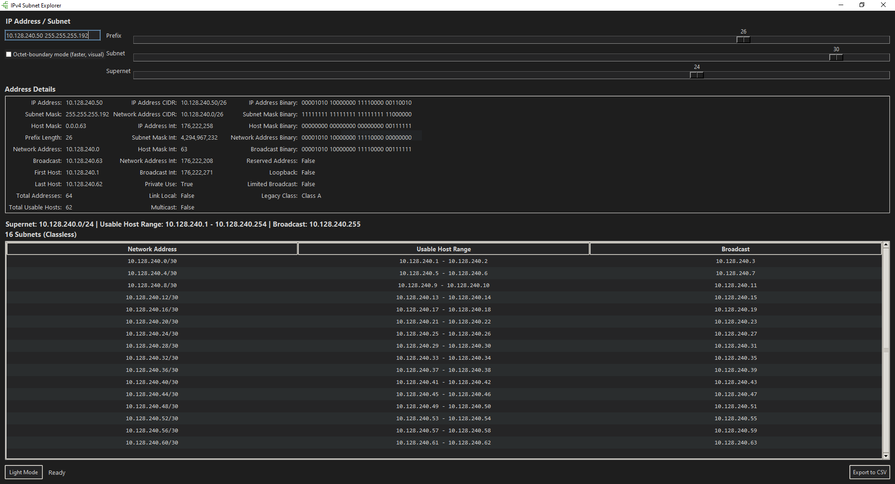
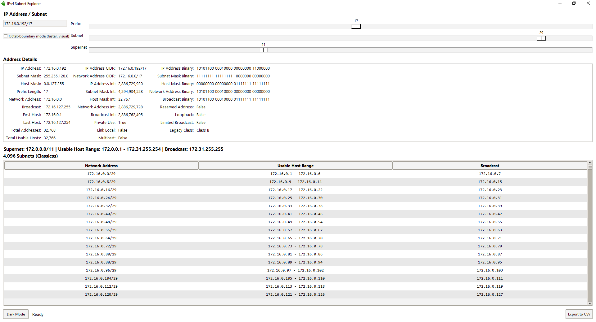

# IPv4 Subnetting Step-by-Step Learning Tool

## Overview

This project is an educational Python tool that includes both a command-line interface (CLI) and a graphical user interface (GUI). It demonstrates IPv4 subnetting concepts through detailed, step-by-step explanations.

It covers:

* Subnet masks, CIDR prefixes, and host masks
* Network and broadcast addresses
* Total addresses and usable host counts

The tool focuses on understanding subnetting concepts rather than memorizing formulas.

---

## Key Features

* Step-by-step subnetting explanations and calculations
* Multiple calculation methods, including binary, block-size, and prefix-length approaches
* Command-line interface with subnetting and supernetting options
* Python class for integration into custom scripts
* Tkinter-based graphical interface for interactive subnet exploration
* Support for multiple IPv4 input formats
* Built-in validation checks
* Beginner-friendly explanatory output
* RFC-compliant handling of /31 and /32 networks (/31 for point-to-point links and /32 as a host route)
* Input validation is performed for supported formats

Unlike many subnet calculators, this tool emphasizes understanding the calculation process rather than only displaying results.

---

## Quick Start

The tool can be used through either the command-line interface or the graphical interface.

**CLI:**

```bash
python cli.py 192.168.1.10/24 --explain
```

**GUI:**

```bash
python gui.py
```

The CLI provides detailed step-by-step explanations, while the GUI supports interactive real-time exploration of the same concepts.

---

## Purpose

Subnetting is often difficult for beginners because many tutorials omit intermediate steps and present multiple calculation methods without explaining the reasoning behind them. This tool improves clarity by:

* Breaking subnetting into structured steps
* Showing multiple solving methods
* Explaining the reasoning behind each result

The explanations are structured as guided walkthroughs similar to instructor-led problem demonstrations.

The tool also introduces simplified subnetting strategies, such as octet-boundary subnetting, to help learners build intuition before working with fully variable-length subnetting.

---

## Target Audience

This tool is best suited for:

* Students learning networking
* Beginners learning subnetting concepts
* Anyone who wants to verify subnetting calculations step-by-step
* Anyone who wants to learn additional subnetting methods

---

## How to Use

This tool can be used through the command line, the graphical interface, or directly as a Python class. All interfaces support multiple IPv4 input formats. It supports quick calculations, step-by-step learning, and verification of subnetting results.

### Basic Usage

```bash
python cli.py <address> [extra] [options]
```

`<address>` represents an IPv4 address in one of the supported input formats. Available options are described below.

---

### Arguments

* `address`
  The IPv4 address in one of the following formats:

  * Dotted decimal

    ```bash
    172.30.5.0
    ```

  * CIDR notation

    ```bash
    127.0.5.1/24
    ```

  * IP address + subnet mask

    ```bash
    10.0.6.7 255.255.255.0
    ```

  * Integer representation + prefix length

    ```bash
    16843009 /8
    ```

  * Integer representation only

    ```bash
    1157895235
    ```

* `extra` *(optional)*
  Used when the selected input format requires a second value, such as a subnet mask or prefix length.

### Options

* `--explain`
  Provides a detailed educational explanation of the subnetting process.

* `--show-steps`
  Displays the calculation steps without extended explanations.

* `--subnet`
  Displays the generated subnet network addresses in CIDR notation for the specified prefix length.

* `--subnet-limit`
  Maximum number of subnet entries to generate and display. Set to `0` to disable the limit and display all generated subnets. The default value is `1000`.

* `--octet-boundary`
  Constrains the displayed subnet enumeration range to an octet-aligned window for visualization purposes. This does not change subnet size, block size, or calculation logic, only the range of subnets that are iterated and shown.

* `--supernet`
  Displays the supernet network address in CIDR notation for the specified prefix length.

---

### Examples

**Basic subnet calculation:**

```bash
python cli.py 192.168.1.10/24
```

**Using IP + subnet mask:**

```bash
python cli.py 10.0.0.1 255.255.255.0
```

**Generate subnets for a specific prefix length:**

```bash
python cli.py 192.168.1.10/24 --subnet 28
```

**Generate subnets using octet-boundary visualization mode:**

```bash
python cli.py 10.0.0.0/8 --subnet 24 --octet-boundary
```

**Display the supernet network address for a given prefix length:**

```bash
python cli.py 192.168.1.10/24 --supernet 16
```

**Display calculation steps only:**

```bash
python cli.py 172.16.5.4/20 --show-steps
```

**Full educational explanation mode:**

```bash
python cli.py 192.168.1.10/24 --explain
```

---

## Subnet Display Modes

This tool supports multiple subnet display modes for large subnet enumerations.

### 1. Standard Display (Default)

Uses fixed-prefix subnetting and generates all valid subnets across the full address range for the specified prefix length.

* Produces all mathematically valid subnets
* Matches real subnet boundaries exactly
* May generate large outputs for small prefix lengths

---

### 2. Octet Boundary Filter (`--octet-boundary`)

This mode does not modify subnet calculations or subnet boundaries. It only limits which subnets are displayed by restricting the iteration range to an octet-aligned segment of the address space.

* Subnet size, alignment, and calculation logic remain unchanged
* Useful for learning subnet patterns and visualizing subnet ranges

---

### When to Use Octet Boundary Mode

Use this mode when:

* Learning subnetting concepts with predictable address patterns
* Viewing subnet ranges in smaller structured segments without changing the underlying subnet logic
* Building intuition about subnet boundaries and subnet alignment

Note: This mode is intended only for visualization. It does not change subnet calculations, block size, or subnet boundaries, only the range of displayed results.

Use the standard display mode when:

* Full and accurate subnet enumeration is required
* Working with real-world network designs or variable-length subnet masking (VLSM)

---

## Graphical User Interface (GUI)

This project includes a Tkinter-based graphical interface (`gui.py`) for interactive IPv4 subnetting exploration as an alternative to the command-line interface. The GUI uses the same underlying `IPv4Address` calculation logic as the CLI to ensure consistent results across both interfaces.

### Dark Mode



### Light Mode



---

### GUI Features

The GUI supports the following features:

* Enter IPv4 addresses in multiple formats, including CIDR notation, dotted decimal, and integer representations
* Automatically recalculate results in real time as input changes
* Adjust prefix lengths and explore subnet and supernet ranges using sliders
* Display subnet breakdowns in tabular form
* Toggle between full subnet enumeration and simplified octet-boundary visualization mode
* Display network metadata, including broadcast addresses, host ranges, and subnet masks
* Explore subnetting concepts interactively
* Switch between dark and light themes
* Sort subnet table by clicking column headers
* Access common actions through a context menu
* Select all subnet table rows using Ctrl+A
* Copy selected subnet table rows using Ctrl+C
* Export subnet table to CSV

---

### Slider Behavior Notes

* The Prefix slider modifies the current network size when the selected input format supports prefix changes
* The Subnet slider only allows prefix lengths larger than the current prefix length for further subnet subdivision
* The Supernet slider only allows prefix lengths smaller than the current prefix length for network aggregation
* Certain input formats, such as IP-only or integer-only input, are treated as `/32` host routes and cannot be resized

---

### Subnet Visualization Mode (GUI Checkbox)

The GUI includes a visualization mode toggle that controls how subnet results are displayed:

* Full subnet mode (default)
  * Displays all mathematically valid subnet ranges
  * Preserves actual subnet boundaries and subnet behavior
  * May generate large outputs for small prefix lengths

* Octet-boundary mode (learning-oriented visualization mode)
  * Simplifies subnet display into octet-aligned address ranges
  * Improves readability and rendering performance for large subnet sets
  * Does not modify subnet calculations or underlying network logic

This mode only affects visualization within the GUI and does not modify the underlying IPv4 calculations.

---

### How to Run the GUI

Run the following command from the project root directory:

```bash
python gui.py
```

---

### Example GUI Workflow

1. Enter `192.168.1.10/24`
2. Increase the Subnet slider to `/28`
3. Observe the subnet breakdown in the subnet table
4. Adjust the Supernet slider to `/16` to observe network aggregation

---

### GUI Overview

The interface is divided into three main sections:

#### 1. Input Section

Allows IPv4 addresses to be entered in multiple formats.
Updates all calculations automatically in real time as input changes.

#### 2. Address Details Panel

Displays detailed calculated information for the selected IPv4 address, including:

* Subnet mask
* CIDR prefix length
* Host mask
* Network address
* Broadcast address
* First and last usable host addresses
* Total addresses and usable hosts
* Binary representations
* Address classifications, including private-use, multicast, and loopback ranges

#### 3. Subnet Table

Displays subnet breakdowns for the selected prefix length, including:

* Network addresses
* Usable host ranges
* Broadcast addresses

---

## Python Class Usage (`IPv4Address.py`)

In addition to the CLI and GUI, the project can also be used as a Python library by importing the `IPv4Address` class from `IPv4Address.py`. This provides programmatic access to the subnetting calculations and helper methods.

### Example Usage in Python

The following example demonstrates direct use of the class in Python:

```python
from IPv4Address import IPv4Address

# Create an IPv4Address instance using CIDR notation
ip = IPv4Address("192.168.1.10/24")

# Display calculated subnet information
print(f"Network Address: {ip.netAdrStr}")
print(f"Broadcast Address: {ip.broadcastStr}")
print(f"First Host: {ip.firstHost}")
print(f"Last Host: {ip.lastHost}")
```

Additional examples are available in the `example.py` script.

---

## What It Teaches

The educational explanations demonstrate two subnetting approaches:

### 1. Binary Method

* Converts IPv4 addresses to binary form
* Demonstrates bit-level operations
* Converts calculated results back to dotted decimal form

### 2. Block Size Method

* Identifies the interesting octet containing the first host bits
* Calculates block size
* Determines subnet ranges using:

  * Iteration
  * Integer division
  * Modular arithmetic

---

## Built-in Verification

The project uses internal validation checks to:

* Verify calculation correctness
* Ensure consistent results across all calculation methods

Note: These validation checks are primarily intended for development and debugging purposes.

---

## Notes on Edge Cases

* `/31` networks follow RFC 3021 (point-to-point links)
* `/32` represents a host route as defined by RFC 4632 and cannot be subdivided further within this tool

---

## Requirements

* Python 3.8+
* Tkinter (typically included with standard Python installations)

---

## Example CLI Output

### Default Output

The following output is produced by running `python cli.py 172.30.197.10/19`

```text
IPv4 Address:  172.30.197.10
Subnet Mask:   255.255.224.0
Host Mask:     0.0.31.255
Prefix Length: 19

Network Address:   172.30.192.0
Broadcast Address: 172.30.223.255

First Host Address:    172.30.192.1
Last Host Address:     172.30.223.254
Total Addresses:       8,192
Usable Host Addresses: 8,190

IP Address (CIDR):      172.30.197.10/19
Network Address (CIDR): 172.30.192.0/19

Binary (IPv4 Address):      10101100 00011110 11000101 00001010
Binary (Subnet Mask):       11111111 11111111 11100000 00000000
Binary (Host Mask):         00000000 00000000 00011111 11111111
Binary (Network Address):   10101100 00011110 11000000 00000000
Binary (Broadcast Address): 10101100 00011110 11011111 11111111

Address Class (Historical):                        Class B
Private Address, Non-Publicly Routable (RFC 1918): True
Link-Local Address, Non-Routable (RFC 3927):       False
Multicast:                                         False
Loopback:                                          False
```

---

## Example Show Steps Output

The following output is produced by running `python cli.py 172.30.197.10/19 --show-steps`

```text
Binary steps for 172.30.197.10/19 (172.30.197.10 255.255.224.0)

IP Address
172.30.197.10 -> 172, 30, 197, 10 -> 10101100 00011110 11000101 00001010

Subnet Mask
255.255.224.0 -> 255, 255, 224, 0 -> 11111111 11111111 11100000 00000000

CIDR Prefix Length (Derived from the Binary Subnet Mask)
11111111 11111111 11100000 00000000 -> 19 1s -> /19

CIDR Prefix Length -> Binary Subnet Mask
172.30.197.10/19 -> /19 -> 11111111 11111111 111 -> 11111111 11111111 11100000 00000000

Host Mask
Subnet mask:                      11111111 11111111 11100000 00000000
Host mask (inverted subnet mask): 00000000 00000000 00011111 11111111

Network Address
     IP address:   10101100 00011110 11000101 00001010
    Subnet mask: & 11111111 11111111 11100000 00000000
                   -----------------------------------
Network address:   10101100 00011110 11000000 00000000

Broadcast Address
        Host mask:   00000000 00000000 00011111 11111111
  Network address: | 10101100 00011110 11000000 00000000
                     -----------------------------------
Broadcast address:   10101100 00011110 11011111 11111111

First Host Address
   Network address:   10101100 00011110 11000000 00000000
                    + 00000000 00000000 00000000 00000001
                      -----------------------------------
First host address:   10101100 00011110 11000000 00000001

Last Host Address
Broadcast address:   10101100 00011110 11011111 11111111
                   - 00000000 00000000 00000000 00000001
                     -----------------------------------
Last host address:   10101100 00011110 11011111 11111110

Total Addresses
Broadcast address:   10101100 00011110 11011111 11111111
  Network address: - 10101100 00011110 11000000 00000000
                     -----------------------------------
                     00000000 00000000 00011111 11111111
            Add 1: + 00000000 00000000 00000000 00000001
                     -----------------------------------
  Total addresses:   00000000 00000000 00100000 00000000

IP Address (CIDR Notation)
172.30.197.10/19

Subnet Mask
11111111 11111111 11100000 00000000 -> 255.255.224.0

Host Mask
00000000 00000000 00011111 11111111 -> 0.0.31.255

Network Address
10101100 00011110 11000000 00000000 -> 172.30.192.0

Broadcast Address
10101100 00011110 11011111 11111111 -> 172.30.223.255

First Host Address
10101100 00011110 11000000 00000001 -> 172.30.192.1

Last Host Address
10101100 00011110 11011111 11111110 -> 172.30.223.254

Total Addresses
00000000 00000000 00100000 00000000 -> 8,192

Usable Host Addresses
8,192 - 2 = 8,190

Block Size Steps for 172.30.197.10/19

Block Size
255.255.224.0 -> interesting octet 3's value = 224 -> block size = 256 - 224 = 32
172.30.197.10/19 -> 19 -> /8, /8, /3, /0 -> /3 (interesting octet = 3) -> 8 - 3 = 5 host bits -> block size = 2^5 = 32

Subnet Mask/CIDR Prefix Length Lookup Table
128=1, 192=2, 224=3, 240=4, 248=5, 252=6, 254=7, 255=8

CIDR Prefix Length -> Subnet Mask
172.30.197.10/19 -> /19 -> /8, /8, /3, /0 -> 255, 255, 224, 0 -> 255.255.224.0

Subnet Mask to CIDR Prefix Length
255.255.224.0 -> 255, 255, 224, 0 -> 8 + 8 + 3 + 0 = 19 -> /19

Host Mask
   All ones:   255.255.255.255
Subnet mask: - 255.255.224.0
               ---------------
  Host mask:   0.0.31.255

Network Address
Interesting octet 3 = 197, block size = 32
197 // 32 * 32 -> 192
Right of octet 3 set to 0 -> 172.30.192.0

Broadcast Address
Interesting octet 3 = 192, block size = 32
192 + 32 - 1 -> 223
Right of octet 3 set to 255 -> 172.30.223.255

First Host Address
172.30.192.0 + 1 -> 172.30.192.1

Last Host Address
172.30.223.255 - 1 -> 172.30.223.254

Total Addresses
172.30.197.10/19 -> 19 -> 32 - 19 = 13 -> 2^13 = 8,192 total addresses

Usable Host Addresses
8,192 - 2 = 8,190
```

---

## Example Explain Output

The following excerpts are taken from the output of `python cli.py 172.30.197.10/19 --explain`

```text
Step 2: Convert the subnet mask to binary.

If the subnet mask is already in dotted-decimal notation (255.255.224.0), repeat the binary conversion process from step 1. The following example uses a condensed version of Method 1:

Subtract Powers of 2 (Condensed Form)
...
Now combine the binary octets in the original IPv4 address order:
11111111 11111111 11100000 00000000 == 255.255.224.0

To calculate the CIDR prefix length from the binary subnet mask, count the number of 1 bits.
11111111 11111111 11100000 00000000 -> 19 1s -> /19

If the IPv4 address is written in CIDR notation (172.30.197.10/19), write 19 consecutive '1' bits followed by 13 consecutive '0' bits (32 - 19 = 13).
11111111 11111111 11100000 00000000

Step 4: Calculate the network address using the IP address and subnet mask.

This calculation uses the bitwise AND (&) operation. If both input bits equal 1, the resulting bit is set to 1. Otherwise, the resulting bit is set to 0.

     IP address:   10101100 00011110 11000101 00001010
    Subnet mask: & 11111111 11111111 11100000 00000000
                   -----------------------------------
Network address:   10101100 00011110 11000000 00000000

Method 1: Compute the total number of addresses using the block size

This method computes the total number of addresses by starting with the block size of the interesting octet and multiplying by 256 for each octet that consists entirely of host bits. Since the interesting octet is the first octet that contains host bits, the block size is determined within that octet.

Each remaining octet that consists entirely of host bits contributes a factor of 256. For prefixes that fall on an octet boundary (/0, /8, /16, /24), there is no partially used octet, so the next octet is treated as the interesting octet. Any remaining octets that consist entirely of host bits then contribute factors of 256.

Examples:

If the network address is 1.0.0.0/8 and the block size is 256, then the last 2 octets consist entirely of host bits.
256 * 256 * 256 = 16,777,216 = total addresses

If the network address is 10.128.0.0/9 and the block size is 128, then the last 2 octets consist entirely of host bits.
128 * 256 * 256 = 8,388,608 = total addresses

For the network 172.30.192.0/19, the block size is 32, and the last octet consists entirely of host bits.
32 * 256 = 8,192 = total addresses

Estimating Large Subnet Sizes

When an exact value is not required, the block-size method can also estimate large subnet sizes. This method works directly with the factors that make up the total number of addresses. Since the number of addresses is always a power of 2, it can be separated into factors of 2 and rearranged into values that are easier to estimate.

Specifically, group factors into sets of 2^10, since 2^10 = 1024. Each group can then be approximated as 1000 to produce a quick estimate.

For the network 172.30.192.0/19, the block size is 32, and the last 1 octet consist entirely of host bits:
32 * 256

32 = 2 * 2 * 2 * 2 * 2

Take 2 factors of 2 (all from 32) and apply them to 1 256 term to form as many 1024-sized groups as possible:

256 * 2 * 2 = 1024 or approximately 1000

Remaining factors:
32 / (2 * 2) = 8

Approximate address count:
8 * 1000 = 8,000 addresses

Note: the prefix-length method is usually simpler for quick estimates, but this block-size method provides an alternative approach to the problem.
```
